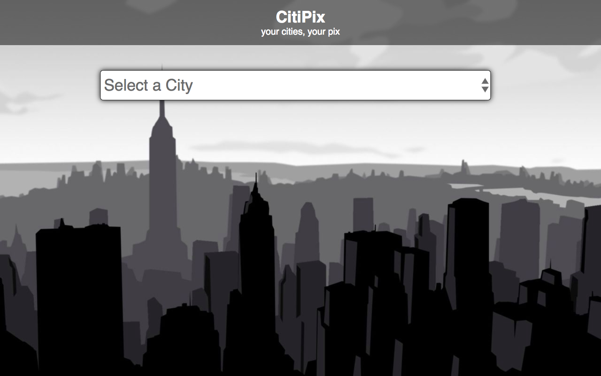
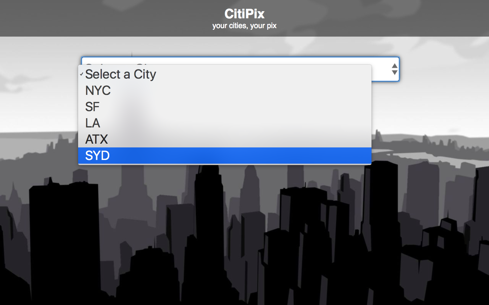

# FEWD Week6: Working with Arrays

### Description

The team from CitiPix has reached out for iteration on their prototype. Instead of using a user's text input to change the background of the interface, the CitiPix user experience designers have asked to see how a drop-down menu would work in place of an input field. The product managers are hopeful it will also lead to less error handling for their engineers and data team. Use what you've learned this week about data-types and arrays to add on top of your work from last week. Be sure to start out with pseudocode.

You are starting out with the same images and CSS as last week. The HTML has been slightly edited to use the new `<select>` tag. Your job is just to add the necessary JavaScript to get the site working.

### Real-World Applications

- Use data stored in an array to manipulate the DOM
- Write pseudocode before writing any JavaScript, in order to demonstrate an understanding of interactive programming theory
- Revisit applications and code you've written in the past to find solutions to problems you've already solved and iterate on a project

### Technical Requirements

- Make a new folder `js` with a new file `index.js` to match our existing HTML script tag
- Create an array with the following values: "NYC", "SF", "LA", "ATX", "SYD"
- Loop through that array on page load and use $.append() to add `<option>` elements to the `<select>`
- Use the `$.change` event handler on the `<select>` element to capture user actions
- When the user changes the input of the drop-down, get the value of the `<select>` by using `$.val()`
- Use `if / else if / else ` conditionals to control the flow of your application
- Change the background image by using jQuery to add/remove classes
- Use Javascript comments to explain each line of your code

#### Bonus

- Support additional cities by editing your array and adding more images
- Read up on your own and incorporate some more styles on the drop down menu
  - [Adding custom graphics to select tags](http://bavotasan.com/2011/style-select-box-using-only-css/)

### Resources

- [W3Schools: Working with Arrays in JavaScript](http://www.w3schools.com/js/js_arrays.asp)
- [MDN: Arrays](https://developer.mozilla.org/en-US/docs/Web/JavaScript/Reference/Global_Objects/Array)
- [W3Schools: Loops in JavaScript](http://www.w3schools.com/js/js_loop_for.asp)
- [W3Schools: Appending HTML elements using JavaScript](http://www.w3schools.com/jquery/html_append.asp)
- [Kirupa.com: Looping in JavaScript](http://www.kirupa.com/html5/loops_in_javascript.htm)

Read ahead [about responsive design for next week](http://www.smashingmagazine.com/2011/01/12/guidelines-for-responsive-web-design/)
