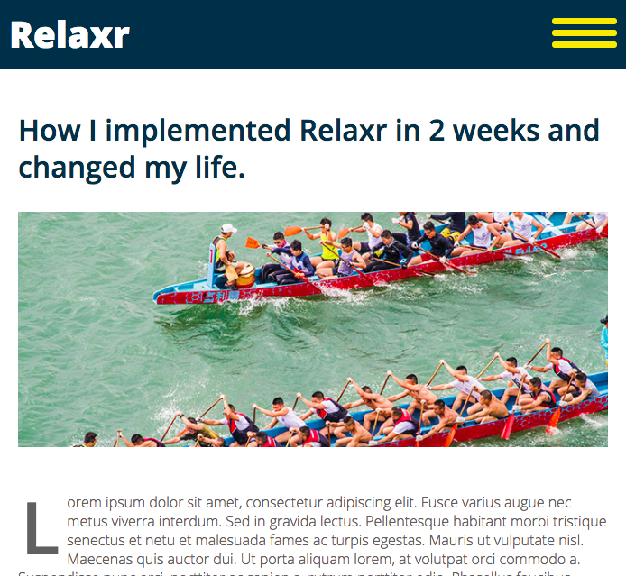

# FEWD Week7: Responsive Design

### Description

Relaxr's user count has grown, and the number of users accessing the site from a mobile device has surprised everyone, even by today's standards. The product managers at Relaxr have asked you to return to the project and make their site responsive so it renders nicely on mobile devices. They had one of their internal developers make a few tweaks to your source code, and they have given you the new HTML / CSS files to work from but they're slightly broken. Using these starter files, finish up out the mobile layouts for the landing page and blog.

### Real-World Applications

- Use Open Graph to personalize links to your site
- Use media queries to render different CSS according to screen size
- Practice adding to an existing CSS stylesheet

### Technical Requirements

- Each page should have a unique `<title>`
- Each page should have the same favicon: [images/icon.png](images/icon.png)
- Implement the four required [Open Graph Tags](https://opengraphcheck.com/)
  - Remember: any URLs in the Graph Tags must be absolute
  - Try viewing your site online via GitHub pages and inspecting to determine the full URLs
- Add the viewport tag to both HTML file's `<head>` so the site renders correctly on mobile
- In CSS, on screens smaller than 768px, change the font-size to 18px for the entire document
- In CSS, on screens smaller than 768px, change `#blog` to `display: block` ([see example](starting_materials/solution_blog_flex.png))
- In `app.js`, make it such that clicking `.hamburger` should toggle the `expand` class on `.dropdown` ([see example](starting_materials/solution_blog_dropdown.png))
- In `app.js`, make it such that clicking `#signup-popup a` should add the `hidden` class to `#popup-container`

NOTE: you should not need to edit any HTML in the `<body>`, nor any CSS outside of a media query

### Resources

- The viewport tag:
  - `<meta name="viewport" content="width=device-width, initial-scale=1.0">`
- [Open Graph Tags](https://opengraphcheck.com/)
- [Lab Solution: 13_media_queries](https://pages.git.generalassemb.ly/fewd201810/class-resources/zips/13_media_queries_solution.zip)
